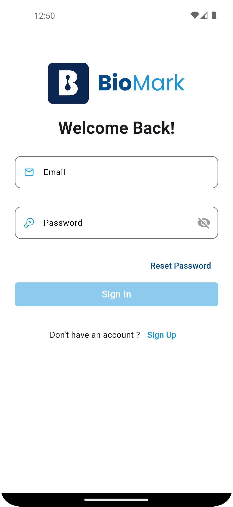
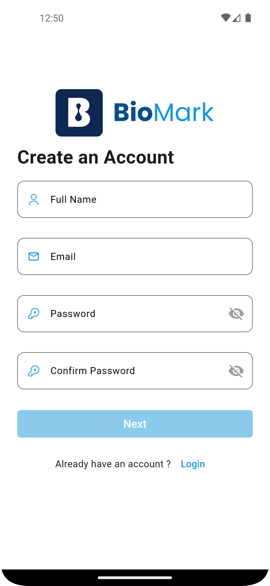
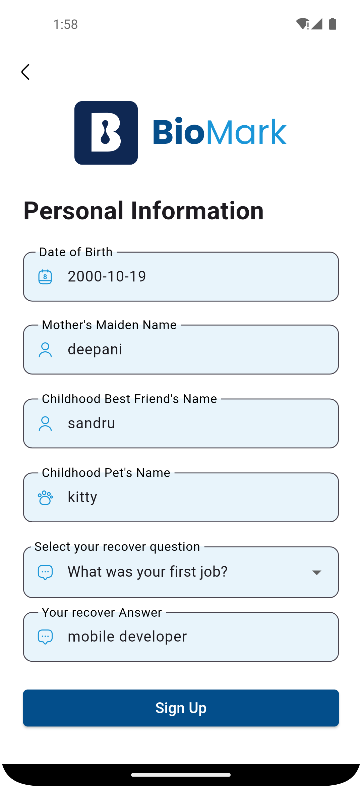
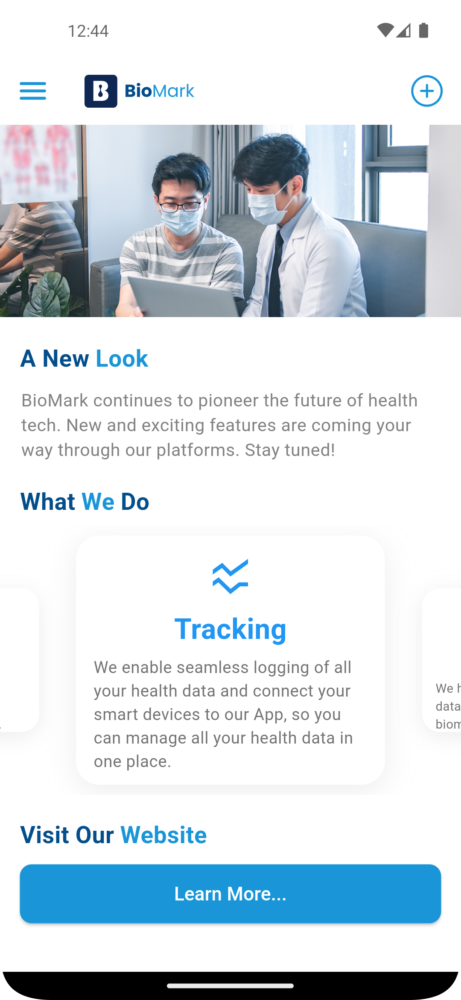
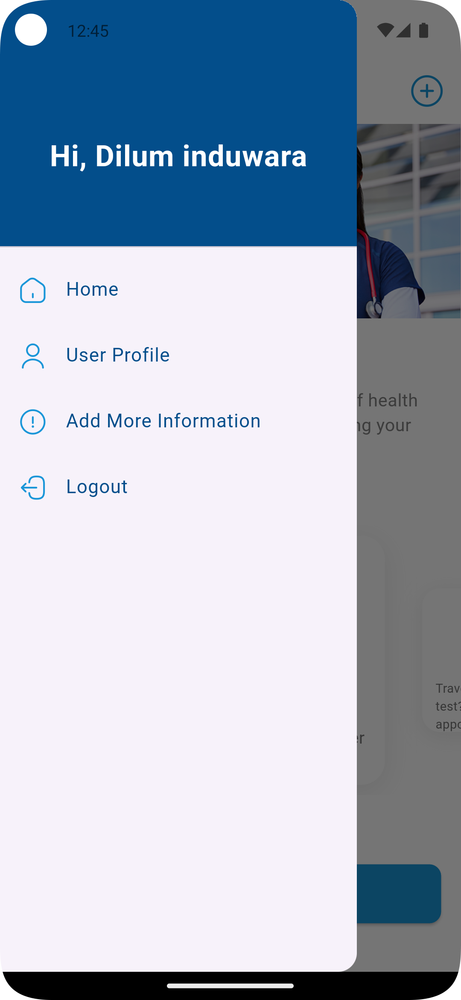
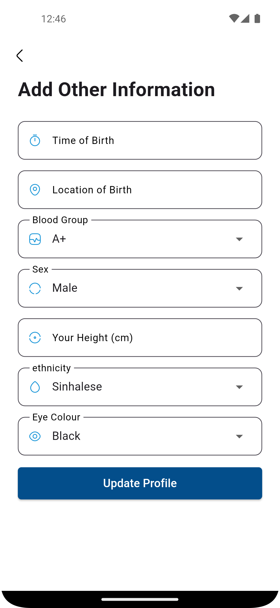
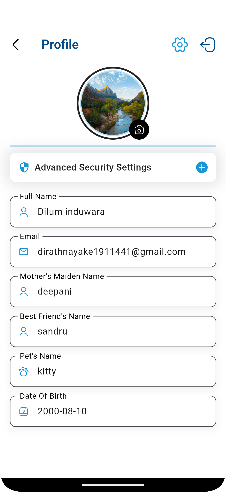
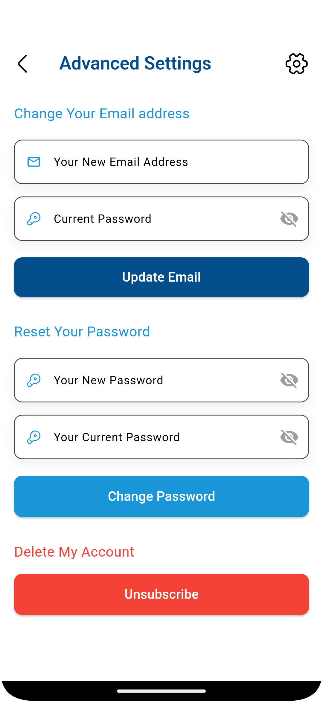
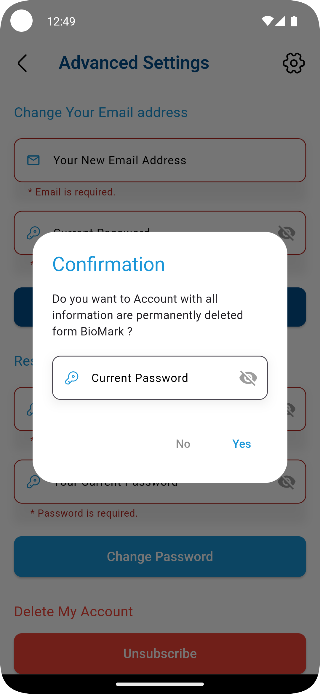
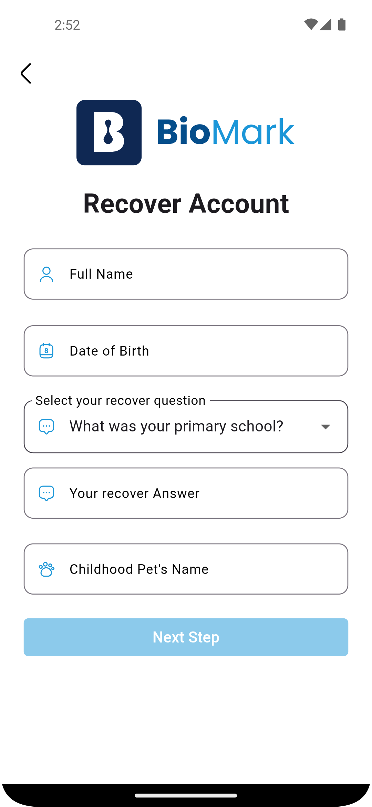

# Biomark Mobile Application

Biomark is a research organization that collects personal data from volunteers to build advanced predictive models. This mobile application empowers volunteers to register, manage personal profiles, and recover accounts, all while ensuring a secure and user-friendly experience.

## 📱 **Technologies Used**
- **Frontend**: Flutter (Dart)
- **Local Storage**: SQLite
- **Backend Services**: Firebase Authentication, Firebase Realtime Database, Firebase Storage
- **Encryption**: Bcrypt & SCRYPT for securing sensitive data
- **Development Environment**: Android Studio

## 💠 User Interfaces 

  

## 🌟 **Key Features**

### 1. **User Registration and Login**
- **Register**: Users sign up by providing an email, password, and key personal information.
- **Login**: Utilizes Firebase Authentication for secure user login.
- **Validation**: All fields are validated using regular expressions to ensure correctness, with robust checks on email and password format.

### 2. **Profile Management**
- **Profile Data**: Collects and stores essential information like Date of Birth, Blood Group, Height, and Eye Color.
- **Immutable Data**: Personal data cannot be arbitrarily modified. Users can only update their email or password.
- **Local Storage**: SQLite provides quick access to profile data locally.
- **Email and Password Update**: Users can change their email or password through the "Profile Advanced Settings."

### 3. **Email and Password Management**
- **Password Change**: Users provide their current password and new password. Reauthentication with Firebase is required before any changes are made.
- **Email Update**: Users are asked to verify their current password before updating their email address. A verification email is sent to the new email, and once confirmed, the system updates the email. A notification is also sent to the old email to alert the user of the change.

### 4. **Account Recovery**
- **Security Questions**: In the "Forgot Password" process, users must answer their security questions (e.g., mother's maiden name, pet's name) and date of birth.
- **Bcrypt Hashing**: Security question answers are hashed using Bcrypt to protect sensitive information.
- **Recovery Process**: Once the security answers are validated, users can set a new email and password to recover their account.
- **Data Linkage**: Hashed mappings are used to indirectly connect profile and security data, ensuring privacy while supporting account recovery.

### 5. **Unsubscribe and Data Deletion**
- **Unsubscribe**: Users can permanently delete their Biomark account by reauthenticating with their password. Once confirmed, the system deletes all user data, and the user is navigated back to the login screen.
- **Uninstallation**: Simply uninstalling the app does not remove data from Biomark's system. Users must unsubscribe to ensure data deletion.

### 6. **Security Measures**
- **Encryption**: Sensitive security data, such as security question answers, are encrypted using the Bcrypt algorithm.
- **Password Security**: Passwords are hashed using Firebase Authentication, which leverages the SCRYPT algorithm to enhance security.
- **Unauthorized Access Prevention**: Notifications are sent to users when their email address is changed, preventing unauthorized access.

## 🔐 **Security Focus**
- **Data Privacy**: Strong encryption techniques ensure personal data remains protected.
- **No Direct Querying**: Personal security information is never queried directly after being created, reducing risks of identification.

## 📈 **Conclusion**
This mobile application for Biomark successfully addresses all core requirements, from secure user registration and profile management to account recovery and data deletion. Built with Flutter and Firebase, the app ensures a smooth, secure, and scalable experience for volunteers. Future developments may include features such as biometric authentication and enhanced UI elements like animations.

## 📁 **Repository**
- [GitHub Repository](https://github.com/Dilum-IR/MobileDev-Mini-Project)
